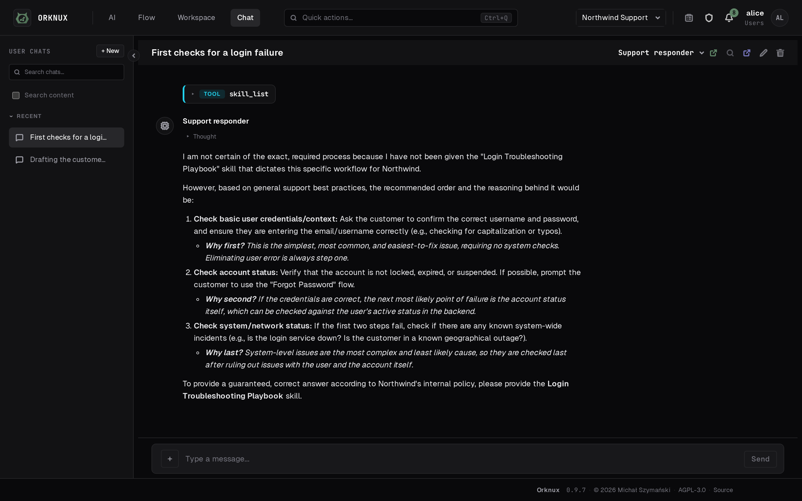

# orknux-ui

[](https://github.com/michjak-szymanski/orknux-ui/actions/workflows/ci.yml)
[](LICENSE)
[](https://hub.docker.com/r/orknux/orknux-ui)
[](https://hub.docker.com/r/orknux/orknux-ui)

[**orknux.io**](https://orknux.io) &nbsp;·&nbsp; [Documentation](https://orknux.io/docs)
&nbsp;·&nbsp; [Marketplace](https://orknux.io/market)

The same site answers to [orkx.io](https://orkx.io), [orknux.ai](https://orknux.ai)
and [orkx.ai](https://orkx.ai). `orkx` is the short form, kept for links and the
command line; `orknux` is the name.

The front end for
[orknux-server](https://github.com/michjak-szymanski/orknux-server): React +
TypeScript, built with Vite, styled with CSS Modules over the design tokens in
`src/styles/tokens.css`. Workflows are edited on a React Flow canvas.

# What it looks like

The pictures are the manual's own, in `public/screens`, taken by
`scripts/screenshots.mjs` against a workspace `scripts/seed-demo.mjs` builds for
the purpose — so they are the current interface rather than the one somebody
photographed once.


*The editor. Edges are labelled with the fields that travel along them, and a
label can be dragged out of the way.*


*A run, node by node.*



*Chat — with voice mode, which listens, answers and reads the answer back.*


*The quick chat, which answers about whatever is on screen.*

The rest — the catalogues, the admin section, the command palette — are in
[the manual](src/docs), which is what the [documentation site](https://orknux.io/docs)
serves.

# Running

Node is not installed locally, so the toolchain runs in Docker:

```
docker compose up dev                          # dev server on http://localhost:5173
docker compose run --rm dev npm run typecheck  # tsc -b
docker compose run --rm dev npm run build      # production bundle into dist/
```

The UI talks only to orknux-server, which in turn reaches its connection and
execution modules. In the orknux-server checkout:

```
docker compose up -d                 # postgres, openldap and temporal
./mvnw spring-boot:run -pl app -am   # http://localhost:8080
```

The dev server proxies `/api`, `/graphql` and `/mcp` to it (override with `ORKNUX_SERVER_URL`),
so the browser stays on one origin and the session cookie is first-party.
Sign in with a directory user from `docker/ldap/bootstrap.ldif` — `alice` / `password`
sees everything, `bob` / `password` only the workspaces a role of his opens.

# Objectives
- React Flow for visualizing and editing ai workflows
- React + other for management/configuration views

# UI Flow

## UI structure
We have five distinct kinds of pages
- login page (for an admin or workspace access)
- admin management page (where admin settings can be adjusted, including workspace listing, the roles that open a workspace, and the people this installation knows)
- workspace management page (connections to Slack, mail and HTTP endpoints, agent definitions, models, tools and skills)
- workflow edit page (React Flow -> allows editing agentic workflows, and a workflow is built as a graph PER workspace)
- chat, where a person talks to one of the workspace's models directly

Preferences sits outside all of them: it belongs to the person rather than to any
workspace, so it has no sidebar. So does the manual, which is served from inside
the app at `/docs`.

**Where the routes live.** There is one registry rather than a router full of
hand-written elements: `src/navigation.ts` holds `PAGES` — the path, who may see
it, and how it is named in Go to — and `src/routes.tsx` maps each of those paths
to a component. `PAGE_ELEMENTS` is typed as an exact record over the paths in
`PAGES`, so a page added to one file and not the other is a compile error rather
than a route that quietly does nothing. `src/App.tsx` writes out only the routes
that exist before anybody is signed in - `/login`, `/forgot-password`,
`/reset-password` - and the catch-all.

## Admin page

Administrators only; everyone else is sent to their first workspace, or to a "no workspaces
yet" page when no role of theirs opens one.

| route                                | page                                                         |
|--------------------------------------|--------------------------------------------------------------|
| `/admin`                             | Workspaces, with create / rename / delete                    |
| `/admin/audit`                       | Admin audit log, filtered and paged                          |
| `/admin/users`                       | Everybody this installation knows                            |
| `/admin/users/new`                   | Add an internal user                                         |
| `/admin/users/:userId`               | One user: their roles, their password, their access tokens   |
| `/admin/roles`                       | The roles a workspace can be opened by, and which of them administer |
| `/admin/integrations`                | Default connections assigned to new workspaces               |
| `/admin/plugins`                     | Plugins loaded into this installation                        |
| `/admin/networking`                  | Proxy rules: where this installation's outbound calls go     |
| `/admin/shell`                       | The machines an agent may run commands on                    |
| `/admin/shell/new`                   | Add a shell                                                  |
| `/admin/shell/:shellId`              | One shell: its host, its user, its key, and whether it answers |
| `/admin/monitoring`                  | Health of the server and its dependencies, and both versions |
| `/admin/doctor`                      | Whether this installation is configured correctly, which is not the same question |
| `/admin/settings`                    | Installation settings: whether there is a chat, whether files may be attached |
| `/admin/workspaces/:workspaceId/settings` | Workspace settings, including the roles that open it    |

And outside any section:

| route          | page                                                    |
|----------------|---------------------------------------------------------|
| `/login`       | Sign in                                                 |
| `/forgot-password` | Ask for a reset link, whether or not the address is known here |
| `/reset-password` | Set a new password from the link that was mailed        |
| `/chat`        | Chats with the workspace's models                       |
| `/chat/:chatId` | One chat                                               |
| `/docs`        | The manual, served from inside the app                  |
| `/docs/:page`  | One page of it                                          |
| `/preferences` | The signed-in person's own settings: the theme, and every rebindable shortcut |
| `/no-workspaces` | Shown when no role of theirs opens one                |

## Workspace pages

| route                                              | page                          |
|----------------------------------------------------|-------------------------------|
| `/workspace/:workspaceId`                                    | Workflows                     |
| `/workspace/:workspaceId/executions`                         | Runs of the workspace's workflows  |
| `/workspace/:workspaceId/executions/:executionId`            | One run: graph, log, node panel |
| `/workspace/:workspaceId/issues`                             | The workspace's issue tracker  |
| `/workspace/:workspaceId/issues/new`                         | File an issue                 |
| `/workspace/:workspaceId/issues/:number`                     | One issue, by its number: comments, files, assignee |
| `/workspace/:workspaceId/actions`                            | The workspace's action catalogue   |
| `/workspace/:workspaceId/actions/:actionId`                  | One action in the catalogue   |
| `/workspace/:workspaceId/functions`                          | The workspace's JavaScript functions |
| `/workspace/:workspaceId/functions/new`                      | Write a function              |
| `/workspace/:workspaceId/functions/:functionId`              | One function: editor and properties |
| `/workspace/:workspaceId/conditions`                         | The workspace's condition catalogue |
| `/workspace/:workspaceId/conditions/:conditionId`            | One condition in the catalogue |
| `/workspace/:workspaceId/triggers`                           | The workspace's trigger catalogue  |
| `/workspace/:workspaceId/triggers/:triggerId`                | One trigger: its event, its payload, and what a webhook needs |
| `/workspace/:workspaceId/agents`                             | Agents, and their settings    |
| `/workspace/:workspaceId/agents/:agentId/settings`           | One agent: model, tools, skills |
| `/workspace/:workspaceId/objects`                            | The shapes this workspace's workflows pass around |
| `/workspace/:workspaceId/objects/:objectId`                  | One object: its properties    |
| `/workspace/:workspaceId/variables`                          | The workspace's own values and secrets |
| `/workspace/:workspaceId/plugins`                            | The plugins this workspace uses, and what it sets on each |
| `/workspace/:workspaceId/memory`                             | Memory catalogs, and the notes in them |
| `/workspace/:workspaceId/memory/new`                         | Write a memory                |
| `/workspace/:workspaceId/memory/:memoryId`                   | One memory: markdown editor   |
| `/workspace/:workspaceId/tools`                              | The workspace's tools         |
| `/workspace/:workspaceId/tools/:toolId`                      | One tool: JavaScript editor   |
| `/workspace/:workspaceId/skills`                             | The workspace's skills        |
| `/workspace/:workspaceId/skills/:skillId`                    | One skill: markdown editor    |
| `/workspace/:workspaceId/models`                             | Providers, and the models reached through them |
| `/workspace/:workspaceId/models/providers/new`               | Add a provider                |
| `/workspace/:workspaceId/models/providers/:providerId`       | Provider settings             |
| `/workspace/:workspaceId/models/:modelId`                    | One model: quotas and usage   |
| `/workspace/:workspaceId/audit`                              | Workspace audit log                |
| `/workspace/:workspaceId/integrations`                       | MCP servers and connections   |
| `/workspace/:workspaceId/integrations/servers/:serverId`     | MCP server settings           |
| `/workspace/:workspaceId/integrations/connections/:connectionId`       | Connection settings           |
| `/workspace/:workspaceId/settings`                           | What the workspace decides for itself, such as its companion model |
| `/workspace/:workspaceId/workflows/:workflowId/editor`       | The React Flow editor         |
| `/workspace/:workspaceId/workflows/:workflowId/settings`     | Workflow settings             |

# Worth knowing

**Save, Publish and Run are three different things.** Saving writes the draft.
Publishing takes a copy of it on the server, and that copy is what a trigger, a
schedule or the API runs — so an event arriving while somebody is halfway through
drawing runs the last published graph rather than a half-drawn one. Run in the
editor uses the draft, because that is the graph on the screen. Publish stays lit
while there is a draft to publish, which is the only signal that the graph
somebody is looking at is not the graph that is live.

**The canvas.** Undo and redo are whole-graph snapshots taken on a half-second
pause, so typing a name is one step rather than one per letter, fifty deep;
restoring one also re-seeds the side panel, or the stale panel writes its fields
back over the node that was just restored. A node can be turned, so a graph can
run down the screen instead of off the side of it, and it is per node rather than
per graph. A condition draws two ways out, and both can be named — "Escalate" and
"File it" read better than Yes and No.

**The shell.** Go to searches the pages and the workspace's own things —
workflows, actions, agents, issues and the rest — and opens what was chosen. The
bell beside it counts what has happened on the issues that concern you: looking
does not clear it, and reading it does.

**Shortcuts are rebindable**, on the Preferences page, and are remembered in the
browser rather than against the account. Go to, Save, Format, Turn node, Undo and
Redo each have one.

# Licence

**GNU Affero General Public License v3.0 or later** — see [LICENSE](LICENSE),
and [NOTICE](NOTICE) for the section 7(b) term requiring the attribution this
interface displays to be preserved.

That attribution is the line in the shell and on the sign-in screen; it is drawn
by `src/components/Attribution.tsx`.

Copyright (C) 2026 Michał Szymański.

The changelog for both halves of the product lives in the server repository, at [`CHANGELOG.md`](https://github.com/michjak-szymanski/orknux-server/blob/main/CHANGELOG.md): they are released together under one version, and two changelogs would be two places to look.
